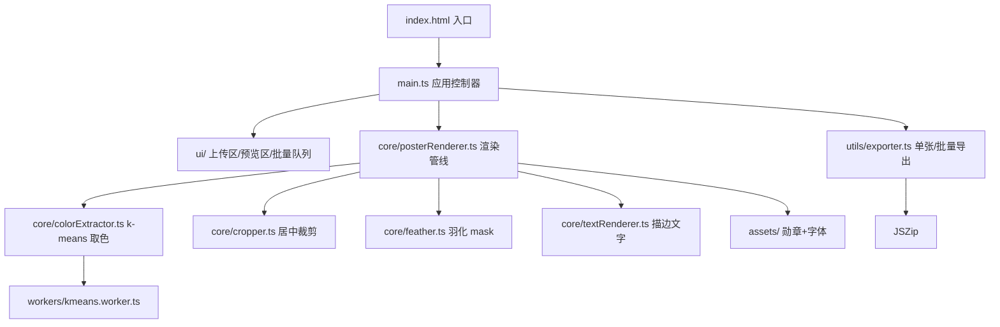

## 产品概述

一个纯前端网页工具，用于将绘本 poster 图片处理为统一视觉规范的 816×426 推荐卡片。用户上传任意尺寸的绘本 poster 并输入标题，即可生成带勋章、标题、取色背景和柔和融合过渡的成品 PNG，支持单张预览下载和批量打包下载。

## 核心功能

- **输入区**：上传绘本 poster（单张或批量，拖拽 / 点击）+ 输入对应绘本标题
- **智能裁剪**：任意尺寸 poster 按 580:326 比例居中裁剪，缩放到 580×326，贴右上角对齐画布边缘
- **智能取色背景**：对 poster 做 k-means 聚类提取主色调色板，选择主色作为背景并叠加轻微渐变，使画布与 poster 色调和谐统一
- **左/下边缘羽化融合**：poster 与画布交界处做 alpha 羽化过渡，柔和自然渐隐到背景色
- **勋章 + 标题排版**：左上角放置 44×52 勋章（距左/上 32dp），紧邻右侧显示标题（间距 12dp）
- **标题样式**：方正兰亭圆简体，字号 44，白色 #FFFFFF，3.6px outside 描边，描边色从 poster 调色板中智能挑选（与背景和谐但不同）
- **实时预览**：参数变更即时渲染效果
- **导出**：单张下载 PNG / 批量 ZIP 打包下载

## 视觉效果

最终成品为 816×426 的横版卡片：右上角是带柔和过渡的绘本 poster，左上角勋章 + 大号白色描边标题，剩余区域为从 poster 提取的和谐背景渐变，整体风格与 `设计规范.png` 一致。

## 技术栈选型

- **构建工具**：Vite（轻量、快速启动、支持 TS）
- **语言**：TypeScript（类型安全，便于组织取色/渲染模块）
- **UI**：原生 HTML + CSS（工具型轻量页面，无需引入组件库；使用 CSS Grid 布局）
- **图像处理**：原生 Canvas 2D API（无额外依赖）
- **字体加载**：FontFace API 动态加载本地 `方正兰亭圆简体_大.ttf`
- **取色算法**：自实现 k-means 聚类（k=5），运行在 Web Worker 避免主线程卡顿
- **批量打包**：JSZip（成熟轻量 ~100KB）
- **文件保存**：FileSaver.js 或原生 `a[download]`

## 实现策略

### 整体流程

```
用户上传 poster → 解码为 ImageBitmap
  → Worker: k-means 提取主色调色板 (5 色)
  → 主线程: 创建 816×426 离屏 Canvas
    → 绘制渐变背景 (主色 → 辅色轻微渐变)
    → 居中裁剪 poster 到 580×326，贴右上角
    → 左/下边缘 alpha 羽化 mask 合成
    → 绘制勋章 (44×52, 左32/上32)
    → 绘制标题 (strokeText outside + fillText)
  → toBlob('image/png') → 预览 / 下载
```

### 关键技术决策

**1. 取色算法（k-means 聚类）**

- 先将 poster 降采样到 100×100（减少计算量），在 Worker 中跑 k-means
- 提取 5 个主色（按像素占比排序）
- **背景色**：取第 1 主色，饱和度/亮度适度调节（避免过亮或过暗刺眼），搭配第 2 主色做对角线轻微渐变（10–15% 亮度差）
- **描边色**：从调色板中选 HSL 色相距背景 ≥ 60° 且饱和度 ≥ 30% 的颜色；若无合适色则取背景互补色，并调节亮度保证和谐
- 复杂度 O(n·k·iter)，100×100×5×10 ≈ 50 万次运算，Worker 内 < 50ms

**2. 智能居中裁剪**

- 输入比例 vs 目标比例 (580/326 ≈ 1.779)：比原图宽则按高度裁剪两侧，比原图高则按宽度裁剪上下
- 使用 `ctx.drawImage(img, sx, sy, sw, sh, dx, dy, dw, dh)` 一步完成裁剪+缩放

**3. 左/下边缘 alpha 羽化**

- 创建与 poster 同尺寸的 mask canvas
- 左边缘：从左到右 `LinearGradient(0→50px)` alpha 0→1
- 下边缘：从下到上 `LinearGradient(0→50px)` alpha 0→1
- 两个渐变相乘（`globalCompositeOperation='destination-in'`）后覆盖到 poster 上
- 再将处理后的 poster 贴到主画布右上角，自然融合

**4. outside 描边实现**

- Canvas `strokeText` 默认是中心描边（一半在内一半在外）
- 实现 outside 效果：`lineWidth = 3.6 * 2 = 7.2`（描边宽度加倍）先 strokeText，再 fillText 覆盖内部，视觉上等效于 3.6px 外描边
- `lineJoin='round'`, `lineCap='round'` 保证转角圆润

**5. 字体加载策略**

- 启动时通过 FontFace API 异步加载 TTF，加载前显示"字体加载中"提示
- 使用 `document.fonts.ready` 确保渲染前字体就绪
- TTF 体积大（约 3–5MB），首次加载后浏览器会缓存

## 实现细节补充（Implementation Notes）

- **性能**：k-means 放 Worker，避免批量处理时阻塞 UI；批量模式用 `for await` 串行处理防止内存峰值
- **预览**：主画布 DPR 适配（`devicePixelRatio`），防止高清屏模糊
- **文件命名**：下载文件名使用用户输入的绘本标题 + `.png`
- **容错**：上传非图片 / 尺寸过小 / 解码失败时提示用户；字体加载失败回退到 sans-serif 并警告
- **日志**：控制台简洁记录关键步骤（取色结果、处理耗时），不打印像素数据
- **合理默认**：勋章图片预加载打包进 bundle（作为静态资源 import），避免每次请求

## 架构设计



## 目录结构

```
PictureBookPosterGeneration/
├── index.html                          # [NEW] 页面入口，挂载 #app
├── package.json                        # [NEW] Vite + TS + JSZip 依赖声明
├── vite.config.ts                      # [NEW] Vite 配置，开启 Worker 支持、静态资源处理
├── tsconfig.json                       # [NEW] TS 配置
├── src/
│   ├── main.ts                         # [NEW] 应用入口，绑定 UI 事件、协调渲染管线
│   ├── styles.css                      # [NEW] 页面样式，两栏布局（左：操作面板，右：预览区）
│   ├── core/
│   │   ├── posterRenderer.ts           # [NEW] 核心渲染管线：输入 poster+标题 → 输出 Blob
│   │   ├── colorExtractor.ts           # [NEW] 取色模块，调用 Worker 执行 k-means，返回调色板 + 背景色/描边色选择逻辑
│   │   ├── cropper.ts                  # [NEW] 按 580:326 比例居中裁剪到 580×326
│   │   ├── feather.ts                  # [NEW] 对 poster 左/下边缘 alpha 羽化，返回带透明过渡的 canvas
│   │   ├── textRenderer.ts             # [NEW] outside 描边文字绘制（strokeText + fillText），处理字体加载
│   │   └── gradientBg.ts               # [NEW] 主色 + 辅色生成背景渐变
│   ├── workers/
│   │   └── kmeans.worker.ts            # [NEW] Web Worker，执行 k-means 聚类，返回调色板
│   ├── ui/
│   │   ├── uploader.ts                 # [NEW] 单张/批量上传 UI（拖拽 + 点击选择）
│   │   ├── previewPanel.ts             # [NEW] 预览画布 + 实时渲染
│   │   └── batchQueue.ts               # [NEW] 批量模式队列展示 + 进度
│   ├── utils/
│   │   ├── exporter.ts                 # [NEW] 单张下载 / 批量 JSZip 打包下载
│   │   ├── colorUtils.ts               # [NEW] RGB/HSL 转换、色相距离、和谐度判断
│   │   └── imageLoader.ts              # [NEW] File → ImageBitmap 解码 + 错误处理
│   └── assets/
│       ├── medal.png                   # [NEW] 勋章资源（复制自根目录"勋章 9.png"）
│       └── font.ttf                    # [NEW] 字体资源（复制自根目录"方正兰亭圆简体_大.ttf"）
└── README.md                           # [NEW] 使用说明
```

## 关键接口定义

```typescript
// core/posterRenderer.ts
interface RenderOptions {
  posterFile: File | Blob;
  title: string;
}
interface RenderResult {
  blob: Blob;
  previewUrl: string;
  palette: string[];      // 调色板 hex
  bgColor: string;
  strokeColor: string;
}
export function renderPoster(opts: RenderOptions): Promise<RenderResult>;

// core/colorExtractor.ts
interface Palette {
  colors: { hex: string; rgb: [number, number, number]; ratio: number }[];
  background: string;     // 背景主色
  backgroundGradient: string; // 辅色（渐变终点）
  stroke: string;         // 描边色（与背景和谐但色相足够区分）
}
export function extractPalette(bitmap: ImageBitmap): Promise<Palette>;
```

## 设计风格

工具型极简风格，参考现代图像处理 Web App（如 remove.bg、tinypng）的干净布局。左侧操作面板，右侧实时预览区，无多余装饰，强调效率和即时反馈。

## 页面布局（单页）

- **顶部标题栏**：工具名 "绘本 Poster 生成器" + 模式切换（单张 / 批量）
- **左侧操作面板（340px）**：
- 上传区（拖拽框，支持点击选择）
- 绘本标题输入框
- 调色板预览（显示提取到的 5 个主色小圆点）
- "生成并下载"主按钮
- **右侧预览区（自适应）**：
- 居中显示 816×426 的成品画布预览（带细边框阴影）
- 批量模式下切换为网格缩略图 + 进度条 + "全部打包下载"按钮
- **底部状态栏**：字体加载状态 / 处理耗时提示

## 视觉细节

- 整体采用浅灰背景 + 白色卡片衬托成品，让生成结果成为焦点
- 主按钮使用柔和蓝紫色渐变，hover 微抬起阴影
- 上传区虚线边框，拖拽悬停时高亮变色
- 预览画布加 8px 圆角 + 柔和阴影
- 调色板小圆点 hover 显示 hex 值 tooltip